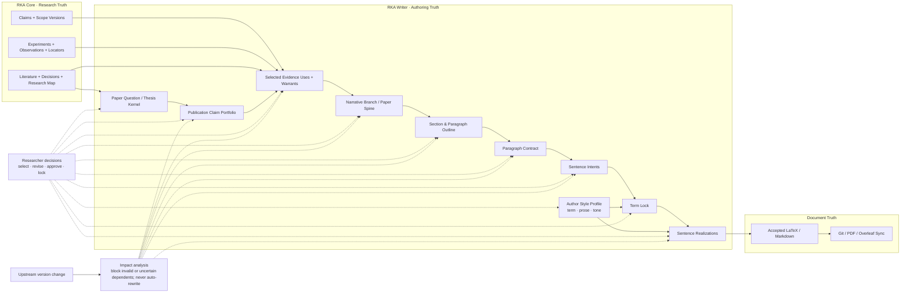

# RKA Writer

RKA Writer is a researcher-controlled writing workbench that helps authors
converge from a research question to a coherent paper. Discussion stays centered
on the paper; a versioned Authoring Graph preserves the meaning, evidence and
decisions behind it. Agents realize one approved sentence intent at a time.

> **Status: W0 design phase.** This repository is being re-baselined from the
> former Writer 0.2 skill distribution. It does not yet contain a supported
> authoring runtime or end-user release.

## Product boundary

The researcher owns scientific meaning and semantic convergence. Writer owns
retrieval, authoring-state management, dependency tracking, decision support,
and bounded language realization.

Writer is built around five invariants:

1. **Question before retrieval; story commitment after evidence review.**
2. **No agent manuscript prose before semantic admission.**
3. **One sentence of output, paper and paragraph awareness.**
4. **Concepts early; exact terms locked before realization.**
5. **Upstream changes trigger impact review, never silent rewriting.**

Two additional product boundaries govern execution and language calibration:

6. **Subscription hosts execute; Writer never owns an API billing path.**
7. **Style is researcher-approved structure, not source-text imitation.**

[RKA Core](https://github.com/rka-project/rka-core) remains authoritative for
research records, claims, evidence, and provenance. Writer owns how approved
research meaning is organized and expressed in a manuscript. Writer never
imports Core internals or opens Core storage directly.

## Architecture at a glance

The graph separates research truth, authoring truth, and document truth.
Researcher decisions govern semantic admission throughout the writing process,
while upstream changes identify dependencies needing review without silently
rewriting accepted text. This is a dependency map, not a mandatory linear wizard.

Model assistance is supplied only by an authenticated Codex or Claude Code
subscription host. Writer has no provider API key, direct model API, metered
fallback, or cross-provider model selector.

Authentication alone is not enough: included-only billing and actual host
context/tool/file isolation must also be established. No adapter is qualified
by the current design documents.

## What the author experiences

Use argument, structure and writing views of the same paper. Discuss one
meaningful question; approve an exact displayed bundle of coupled changes;
review sentence candidates in context. Fine-grained storage does not require
one approval click per object. Human notes and direct edits are preserved.

Style can start from selected examples or direct preferences, then be calibrated
on the same admitted meaning. Accepting an edit does not silently teach a global
rule. Requested whole-paper review is read-only and advisory.

The graph can enforce version and authority boundaries. It cannot prove that
evidence entails a claim or that a paper reads well. Those require separate
scientific and author/reader assessment.

## Start here

| Document | Purpose |
|---|---|
| [Status](STATUS.md) | Current phase, accepted decisions, and immediate gate |
| [Roadmap](ROADMAP.md) | W0-W5 milestones and exit criteria |
| [Vision](docs/vision.md) | Product problem, user, goals, and non-goals |
| [Principles](docs/principles.md) | Product invariants and researcher-control rules |
| [Design refinement](docs/adr/0008-paper-centered-incremental-commitment.md) | Accepted principles versus implementation hypotheses |
| [RFC 0001](docs/rfcs/0001-authoring-ir-and-convergence-protocol.md) | Proposed Authoring IR and convergence protocol |
| [RFC 0002](docs/rfcs/0002-subscription-host-and-paper-studio.md) | Proposed subscription-host and Paper Studio interaction |
| [RFC 0003](docs/rfcs/0003-researcher-owned-style-profile.md) | Proposed researcher-owned term, prose, and tone profile |
| [Architecture](docs/architecture/authoring-graph.md) | Current consolidated authoring-graph view |
| [Paper Studio](docs/architecture/paper-studio.md) | Semantic-zoom information architecture |
| [Subscription runtime](docs/architecture/subscription-host-runtime.md) | Fail-closed host execution boundary |
| [Style profile](docs/architecture/style-profile.md) | Sample-to-rule language-calibration boundary |
| [W1 evaluation](docs/evaluation/w1-acceptance-criteria.md) | First vertical-slice acceptance contract |
| [W0 walkthrough](docs/evaluation/w0-walkthrough.md) | Early author workflow and host-feasibility validation |
| [W1 fixture](docs/evaluation/w1-fixture-spec.md) | Sanitized end-to-end scenario and expected transitions |
| [Contributing](CONTRIBUTING.md) | RFC, ADR, issue, and implementation workflow |

## What is preserved

- The complete Writer 0.2 plugin distribution is frozen at local tag
  `writer-skill-v0.2.0` and remains the W5 comparison baseline.
- The verified legacy Core bundle importer remains under
  [`legacy/core-import-v1`](legacy/core-import-v1/README.md).
- The previous platform design is retained as
  [design history](docs/history/platform-design-v0.md).
- The isolated academic Reviewer suite has been separated from the active
  Writer product. Its old integration contract remains
  [historical context](docs/history/reviewer-integration-v0.md).

## Current implementation rule

W0 validates workflow and feasibility before production contracts freeze.
Run the author walkthrough and bounded host checks, then authorize only the
minimal W1 path: one paragraph within a paper scaffold, including impact
review, style calibration, direct-edit reconciliation and recovery.

Do not add a general editor, autonomous drafting agents, broad generation,
provider API path or production schemas during this design phase. RFCs remain
Provisional. Repository checks and a merged design PR do not establish user
benefit, semantic accuracy or host conformance.

## Repository process

Large design changes begin as RFCs. Accepted architectural decisions are
recorded as focused ADRs. GitHub issues and pull requests track work in flight;
the roadmap records durable sequencing and exit gates.

This repository is licensed under the [MIT License](LICENSE).
