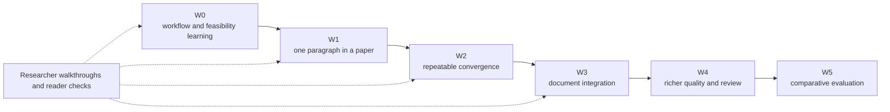

# RKA Writer Roadmap

This is the detailed Writer track. Core and Hugging Face access work are
independent. Milestones express learning and delivery gates, not a promise that
more documentation proves the product works.

## W0 — Validate the workflow and execution boundary

Keep the accepted authority, sentence-admission, no-silent-rewrite and
subscription-included-only principles. Do not freeze all artifact schemas,
panel positions or style rules yet.

Run two bounded investigations:

- **Author workflow:** use a real-project-derived sanitized paper scaffold and
  the [walkthrough](docs/evaluation/w0-walkthrough.md) to test a meaningful
  discussion, an exact approval bundle, a paragraph plan, a changed belief,
  style calibration, an external edit and recovery. Static/mock interactions
  use supplied text and no unapproved prose generation.
- **Host feasibility:** begin with read-only official capability inspection;
  separately establish auth, no extra paid usage, actual context/tool/file
  isolation and structured result handling. Do not consume inference merely
  to test whether paid fallback happens. Unknown support is a failed gate,
  not permission to weaken the boundary.

Exit: record the walkthrough observations, unresolved problems, a usable minimal
contract, sanitized host evidence and explicit authorization of the bounded W1
implementation. Accept only the RFC subset supported by these results; leave
remaining details Provisional. A merged design PR or fake-host test does not
complete W0. Workflow experiments can continue if the real host gate is blocked.

## W1 — One traceable paragraph within a paper

Use a compact approved question/claim portfolio, selected evidence, Paper Spine,
section outline and paragraph allocation. Complete one paragraph's contract,
intent plan, minimal style profile, term locks and one-at-a-time realizations.

The first slice includes:

- an exact approval bundle without duplicate confirmations;
- compact full-paper plus detailed paragraph context;
- one host that has passed all execution gates;
- structural checks, semantic review and author acceptance as distinct layers;
- one upstream evidence withdrawal and one claim-scope revision;
- one non-blocking style preference change;
- a human direct edit, conflict-safe reconciliation and cold-start recovery;
- researcher effort and reader-comprehension observations.

Exit: pass [W1 criteria](docs/evaluation/w1-acceptance-criteria.md), retain
evidence of failures as well as successes, and decide which contracts are stable
enough for W2. A synthetic expected-result file alone is not a passed runtime.

## W2 — Repeatable paper-centered convergence

Extend to several connected paragraphs and sections, argument/structure/writing
views, understandable impact review, branch comparison and contextual dialogue.
Improve the minimal profile only where author behavior demonstrates need.

Exit: the author can resume, change focus, reopen a justified decision and
recover without accidental broad rewrites or excessive repeated approval.
Do not require a second host, full Style Lab, or sophisticated oscillation
detector to prove the core workflow.

## W3 — Document integration

Expand W1's minimal anchoring and direct-edit reconciliation to robust
Markdown/LaTeX, Git, PDF, multi-file and external-editor workflows. Preserve
external edits and stable mapping across formatting, sentence splits and moves.

Exit: recovery and conflicting edits are safe on representative projects.
Choose integration technology from observed workflow needs, not a W0 mockup.

## W4 — Richer quality and isolated review

Extend the minimum W1 evidence/scope checks with numerical, terminology,
style-drift, reader-path and optional whole-paper audits. Requested review is
read-only and isolated; findings become selected proposals, never automatic
edits. Second-host support is optional and must pass the same billing/isolation
gates. Neither feature is a prerequisite for a useful first release.

## W5 — Comparative evaluation

Run the [comparison plan](docs/evaluation/baseline-comparison.md) across
representative authors and tasks. Formal comparative evidence is later;
formative human evaluation starts in W0 and continues at every milestone.

Report fidelity, comprehension, voice, effort, recovery, invalidation precision
and justified versus accidental reopening. Report semantic errors rather than
claiming deterministic absence. Enforce no unauthorized accepted-state
mutation, no silent upstream rewrite, no API path and no paid continuation.
