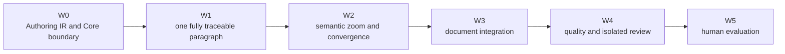

# RKA Writer Roadmap

The roadmap is ordered by semantic dependency, not by delivery date. A later
milestone may be explored, but it is not ready for implementation until the
preceding exit gate passes.



## W0 — Authoring IR and Core boundary

Freeze `CoreBindingSnapshot`, `WriterArtifact`, immutable `ArtifactVersion`,
exact `DependencyEdge` versions, `DecisionCard`, lifecycle/readiness, semantic
patches, source maps, role permissions, sentence admission, and the crosswalk
from legacy Core manuscript/planning semantics.

Exit criterion: RFC 0001 and focused ADRs are accepted, and a sanitized W1
fixture can represent every required artifact, dependency, permission, and
staleness transition.

## W1 — One fully traceable paragraph

Validate one complete path:

```text
1 provisional central question
→ 1 approved paper question
→ 1 publication claim
→ 2–4 selected evidence uses
→ 2 narrative alternatives
→ 1 selected narrative move
→ 1 approved paragraph contract
→ 4–6 sentence intents
→ 3–5 locked terms
→ 4–6 accepted sentence realizations
→ 1 grounded paragraph
```

Then change one upstream claim and prove that the affected paragraph becomes
stale, the impact report is complete, no text is rewritten, and the researcher
may explicitly revalidate or regenerate.

## W2 — Semantic zoom and convergence

Implement paper, section, paragraph, and sentence navigation; a decision queue;
branch comparison; locks; impact propagation; a session capsule; and semantic
oscillation detection.

Exit criterion: a researcher can resume, compare alternatives, and converge
without reopening settled high-level decisions accidentally.

## W3 — Document integration

Implement Markdown/LaTeX source maps, sentence and block anchors, Git
synchronization, PDF compilation, direct-edit reconciliation, and conflict-safe
patching.

Exit criterion: Writer state and manuscript bytes remain traceable without
silently overwriting accepted text or external edits.

## W4 — Quality and isolated review

Add evidence, terminology, claim-scope, numerical, defensive-prose, voice, and
reader-facing audits. Import only researcher-selected findings from a frozen,
isolated review context.

Exit criterion: audits are advisory, anchored, deduplicated, and cannot mutate
authoring state without a researcher-approved semantic patch.

## W5 — Human evaluation

Compare a conventional general-LLM writing prompt, the frozen Writer 0.2 skill,
and the RKA Writer workbench. Measure scientific fidelity, convergence,
researcher control and effort, and reader-facing quality.

Hard requirements are zero silent claim changes, zero silent term changes,
zero silent evidence reinterpretations, and zero silent upstream-triggered
rewrites.
