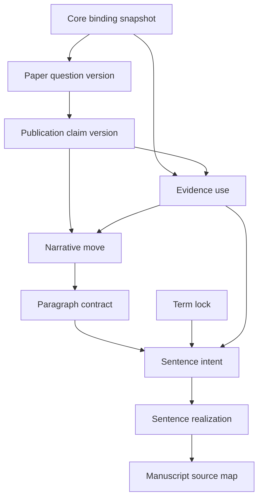

# Authoring Graph

The Authoring Graph is the canonical structured representation of approved and
provisional manuscript meaning.

Every node is a logical artifact with immutable versions. Every edge points to
an exact upstream version and names why the dependency exists. Approval,
rejection, locking, supersession, and retirement are events rather than
in-place loss of history.

The graph supports four essential questions for any manuscript sentence:

1. Why is this sentence here?
2. What exact proposition and rhetorical function does it realize?
3. Which evidence, term decisions, and researcher approvals constrain it?
4. What becomes stale if an upstream assumption changes?

Storage representation remains provisional during W0. The logical artifact and
dependency contracts are independent of whether the first prototype uses files
or SQLite.
