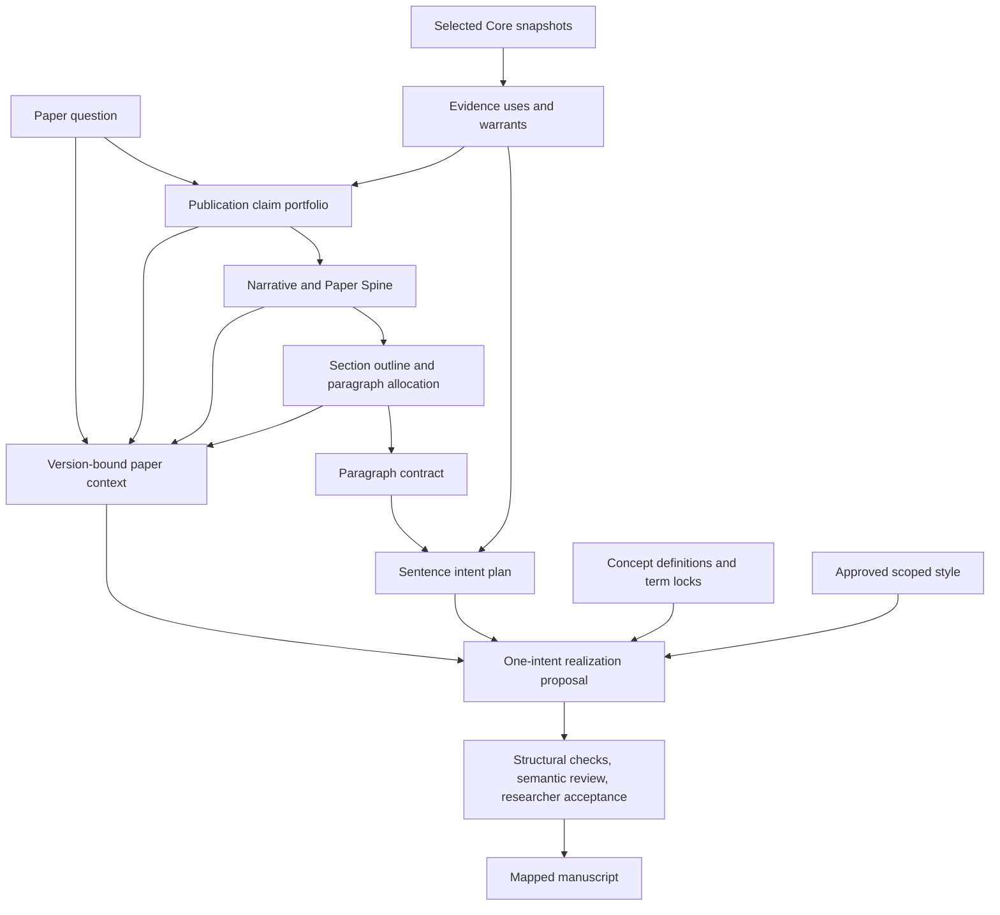

# Authoring Graph

The graph preserves authoring intent and lineage. It is not a proof of
scientific truth and is not the default UI. This is a logical view under
[ADR 0008](../adr/0008-paper-centered-incremental-commitment.md), not a frozen
database schema.

Evidence and claim candidates can be explored together. The diagram describes
dependencies of a committed version, not a chronological rule that every
provisional record must already be finalized.

## Four granularities

Store individual artifacts. Discuss meaningful questions. Approve exact bundles
of coupled versions. Generate one admitted sentence candidate set at a time.
No approval is inferred from navigation, silence, chat history or a model's
report. An approval cannot cover unseen future versions.

## Currentness

Edges retain exact upstream version, consumed content/contract, reason and
effect. A new upstream version creates impact candidates; known-invalid and
unknown semantic effects block affected production. Preference-only changes
are non-blocking. Demonstrable non-semantic changes can be classified without
claiming a model proved semantic equivalence.

Keep historical versions and manuscript bytes unchanged. Revalidation records
compatibility/approval against a new upstream version instead of silently
rebinding the old artifact. Conservative review is required when dependency
granularity cannot establish non-impact. See
[RFC 0001](../rfcs/0001-authoring-ir-and-convergence-protocol.md).

## Trace and recovery

A sentence explains its question, claim, section/paragraph role, intent,
selected evidence, terms and author decisions. Background orientation is not
evidence authorization. Human-edited bytes are preserved and marked for
reconciliation rather than forced back to graph output. Operational host
receipts remain separate from scientific and authorial authority.
