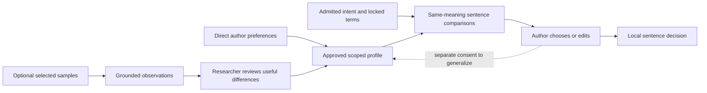

# Researcher-Owned Style Profile

The profile records the author's endorsed term, prose and tone preferences.
It is not an imitation prompt and does not supply scientific evidence.

## Calibration flow

Exact concepts and field terminology outrank personal lexical habits.
Most prose/tone rules are advisory and section/function-specific. Rule polarity
(prefer/avoid) is separate from enforcement (advisory/required). A narrower rule
overrides a broader one only through an explicit approved override.

The initial realization path uses resolved rules and excludes whole samples.
A small source-bound approved example set is a separately evaluated option,
not blanket access to sample papers. Compare copying risk and actual author
preference before adopting it.

Source selection is optional; a transparent default or direct-instruction
profile is valid. An accepted edit never silently teaches a global rule.
Source changes prompt lineage review without automatically revoking the
author's independently endorsed preference. No automatic rewriting occurs.

Semantic support, style fit and copy-risk assessments remain distinct.
A flagged distinctive phrase requires replacement, appropriate quotation or
a documented false-positive determination. See
[RFC 0003](../rfcs/0003-researcher-owned-style-profile.md).
