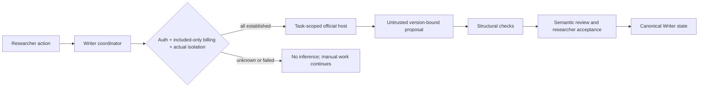

# Subscription Host Runtime

Writer's local coordinator owns state and admission. A qualified subscription
host supplies isolated proposal computation, not approval. This is a proposed
architecture; no adapter has yet passed the design's qualification gates.

## Three separate gates

- Official subscription authentication.
- Host-enforced use of included resources only, excluding additional paid
  credits or API continuation.
- Effective isolation of context, tools and filesystem, not just a narrow prompt.

Account type and a quota snapshot do not establish all three. Concurrent quota
use defeats a check-then-dispatch billing assumption. If supported host controls
cannot enforce the boundary, the adapter remains unsupported for automated
inference. No paid experiment is needed to discover this.

## Proposed transport and authority

Investigate a Writer-initiated task-scoped Codex App Server run first. Do not
assume an existing desktop chat is remotely controllable or clean of context.
A host-native MCP ticket workflow is a distinct alternative, not the same
control plane.

Give the host only approved read context and a proposal-output channel. Do not
give it Core writes, acceptance authority or canonical document write access.
Record effective policy and observations with explicit unknowns; a Writer-made
receipt is not an attestation. Keep sample extraction separate from realization.

## Failure and privacy

Unknown, exhausted, expired or changed host/policy states stop new dispatch.
Late or duplicate results are reconciled by request ID and base versions; an
uncertain consuming request is not automatically retried. Quarantine stale
results, preserve human edits and retain read-only/manual/export paths.

Local-first storage does not imply local inference. Selected content sent to a
cloud-backed host leaves the device under the host's data controls.

See [RFC 0002](../rfcs/0002-subscription-host-and-paper-studio.md) for official
source evidence, detailed transitions and the unresolved feasibility questions.
