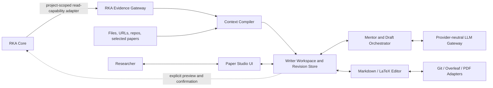

# RKA Writer Platform: Product Vision, Architecture, and Roadmap

> **Status: Superseded in part on 2026-09-03.** This document is preserved as
> design history. Its research/manuscript authority separation, provenance,
> source synchronization, and Reviewer isolation remain useful inputs. Its
> prose-first drafting flow, two coarse checkpoints, and W1 multi-paragraph
> target are replaced by RFC 0001 and the current W0-W5 roadmap.

> **Status: proposed design outline.** This document describes the intended
> direction of the Writer platform. It is not a description of currently
> implemented behavior, an implementation specification, or a change to the
> RKA Core roadmap.

## Executive summary

RKA Writer should evolve from a drafting skill into a researcher-in-the-loop
environment for turning a research insight and selected evidence into a
coherent scientific manuscript. This document uses **RKA Paper Studio** as a
working product name.

Paper Studio treats RKA Core as an auditable knowledge and provenance
substrate—not as an outline generator or a checklist of facts to reproduce.
The Studio gives researchers direct control over framing, terminology, claim
strength, contribution priority, disclosure, and final prose. AI supports
argument development, selective evidence retrieval, drafting, revision, and
review. Manuscript text remains directly editable, every substantive AI change
is inspectable, and provenance remains available without leaking RKA's internal
structure into public prose.

The first meaningful success is not an automatically completed paper. It is a
reliable path from noisy research records to an author-approved spine and then
to natural, coherent, selectively grounded paragraphs.

## 1. Motivation

RKA records and manuscripts serve different purposes. RKA is optimized for
preservation, retrieval, provenance, and longitudinal reasoning. A paper is
optimized for a reader: it must foreground a small number of ideas, reveal them
in a deliberate order, and use evidence selectively to support an argument.

A skill-only Writer can blur this distinction in several ways:

1. **Record-by-record grounding.** Facts, decisions, and journal entries become
   a coverage checklist, producing accurate but fragmented prose.
2. **Audit-language leakage.** Internal uncertainty, provenance labels,
   protocol details, rejected paths, and speculative reviewer objections enter
   the manuscript even when they are not material to its central claim.
3. **Terminology inflation.** Internal shorthand or newly invented labels are
   introduced before the underlying idea is explained in plain language.
4. **Local optimization without a global story.** Section-level rules improve
   isolated passages while weakening the manuscript's overall logic ladder.
5. **Insufficient researcher participation.** Chat-only generation gives the
   author too little control over framing, terminology, claim scope, and
   revision decisions.
6. **Over-constrained prose.** More templates, checks, and reviewer instructions
   can make sentences mechanical or defensive rather than natural.

Paper Studio therefore has one central objective:

> Convert private research memory into an author-approved argument before
> producing public prose.

### Design precedent: PaperMentor

[PaperMentor](https://aclanthology.org/2026.acl-demo.39/) demonstrates the value
of contextual, specialist writing feedback inside an author's existing
Overleaf workflow. Its source-anchored comments, modular guidance, and explicit
author control are useful precedents. Paper Studio retains those ideas in an
optional Review mode, but extends the workflow upstream: it helps the
researcher construct the argument before drafting, selects RKA evidence rather
than exposing a record dump, and keeps provenance available without turning it
into prose. The design borrows PaperMentor's interaction principles, not its
fixed agent count or its full Overleaf implementation.

## 2. Goals and non-goals

### Goals

- Support a continuous path from insight to spine, scope, literature gap,
  research questions, contributions, evaluation, outline, draft, and revision.
- Produce plain, natural, venue-appropriate academic prose without sacrificing
  factual or evidentiary fidelity.
- Keep the researcher in control of scientific meaning and consequential
  writing decisions.
- Retrieve RKA evidence selectively and preserve inspectable provenance.
- Let researchers directly edit every author-facing artifact.
- Present AI changes as suggestions or diffs that can be accepted, edited,
  rejected, deferred, resolved, or locked.
- Learn terminology and rhetorical patterns from researcher-selected related
  work and writing samples without copying their language.
- Integrate safely with Markdown, LaTeX, Git, PDF workflows, and eventually
  Overleaf.
- Remain provider-neutral at the model layer.

### Non-goals

- Paper Studio is not a replacement UI for RKA Core.
- It does not automatically turn every RKA record into manuscript content.
- It does not decide scientific meaning, claim scope, or contribution priority
  on behalf of the researcher.
- It does not use agent count, reviewer count, or workflow complexity as a
  measure of quality.
- It does not hide limitations whose omission would materially mislead the
  reader, affect ethics or safety, or undermine reproducibility.
- The initial product does not fork or rebuild the full Overleaf platform.
- Drafts, rejected alternatives, review chatter, and stylistic preferences do
  not automatically become RKA knowledge.

## 3. Sources of authority

The platform separates research truth, argument truth, and document truth.

| System | Authoritative state | State it must not own |
| --- | --- | --- |
| **RKA Core** | Journals, decisions, literature, missions and results, claims, clusters, research questions, evidence, provenance, contradictions, and freshness | Draft wording, rejected writing alternatives, AI comments, and copy-edit choices |
| **Paper Studio** | Author intent, approved spine, terminology, argument cards, disclosure choices, outline, author decisions, provenance bindings, patch history, immutable source snapshots, and review state | The final status of underlying research facts or the current public manuscript bytes |
| **Local manuscript files and Git** | Current LaTeX or Markdown source, BibTeX, figures, compiled artifacts, and source history | The research knowledge graph or argument rationale |
| **Overleaf** | An explicitly synchronized collaboration replica | An implicit winner over conflicting local changes |
| **LLM provider** | No authoritative persistent state | Research truth, author decisions, or document history |

RKA is optional and read-mostly. Paper Studio must remain useful with files,
URLs, repositories, and researcher-provided evidence alone. When an RKA project
is linked, every project-scoped request pins its project identifier explicitly.

## 4. Product invariants

These invariants define the product more strongly than any particular prompt,
model, or agent topology.

- **INV-01 — Story before retrieval.** Establish the reader question and
  argument intent before searching for supporting material.
- **INV-02 — Selection, not coverage.** Evidence being available does not mean
  it belongs in the manuscript.
- **INV-03 — Private provenance.** RKA identifiers, confidence labels,
  retrieval scores, internal doubts, and audit language never enter public
  prose automatically.
- **INV-04 — The researcher owns meaning.** Framing, central claims, terms,
  contributions, scope, and material disclosure remain researcher-controlled.
- **INV-05 — Direct editability.** Every author-facing artifact can be edited
  directly, without going through chat.
- **INV-06 — Inspectable AI changes.** Substantive modifications appear as
  suggestions or diffs and never silently replace accepted work.
- **INV-07 — Consequential interruption only.** The system blocks only when a
  choice changes what the paper claims, why it matters, what evidence means, or
  what must be disclosed.
- **INV-08 — Materiality over defensiveness.** Material limitations are stated;
  speculative objections, internal hesitation, and irrelevant defense remain
  in the private workspace.
- **INV-09 — Plain terms first.** Explain the concept before introducing a
  necessary term or abbreviation.
- **INV-10 — Review is advisory.** Reviewers produce comments and decision
  cards; they do not directly rewrite the manuscript.
- **INV-11 — Explicit write-back.** Every proposed RKA mutation is previewed
  and individually confirmed by the researcher.
- **INV-12 — Graceful degradation.** Loss of RKA, an LLM provider, or a sync
  service must not corrupt accepted work or prevent local reading and editing.

## 5. Conceptual model

Paper Studio maintains a bounded set of versioned artifacts:

- **Source Manifest** — linked RKA project, manuscript sources, files, URLs,
  repositories, related work, and writing samples.
- **Author Brief** — intended contribution, target reader, venue, constraints,
  must-preserve meaning, and desired style.
- **Thesis Kernel** — the shortest useful statement of the central insight.
- **Paper Spine** — the approved problem-to-payoff logic of the paper.
- **Scope Contract** — research object, assumptions, system or threat model,
  applicable scope, non-goals, and material disclosure choices.
- **Literature Map** — selected related work, comparison dimensions, and gap
  alternatives.
- **Term Bank** — preferred terms, plain definitions, accepted variants, terms
  to avoid, and examples from selected papers.
- **Evidence Packet** — a private, provenance-bearing summary of candidate
  research evidence.
- **Argument Card** — an author-approved narrative unit that may be used for
  drafting.
- **Paper Contract** — aligned research questions, claims, contributions, and
  evaluation obligations.
- **Challenge–Innovation Map** — the author-approved relationship among the
  motivating gap, technical challenges, insights, and design consequences.
- **Evaluation Contract** — the evidence, baselines, metrics, experiments, and
  interpretation criteria required for each important claim.
- **Outline Node** — section or paragraph purpose, reader question, transition,
  and evidence requirement.
- **Draft Revision** — an immutable Paper Studio snapshot that references a
  specific local source state and its accepted patches.
- **Evidence Audit Finding** — an author-facing grounding, freshness, scope, or
  materiality issue found outside the public prose.
- **Review Finding** — an anchored, advisory comment on a frozen revision.
- **Decision Card** — a consequential question, recommendation, alternatives,
  author choice, and downstream impact.
- **Decision Queue** — a view over unresolved Decision Cards, not a separate
  source of truth.
- **Export Snapshot** — the source hash, build result, and explicit Git or
  Overleaf synchronization state for one manuscript version.
- **Evidence Snapshot** — the versioned set of Evidence Packets and RKA
  bindings used by an argument or exported manuscript.
- **Session Capsule** — compact state for reliable continuation after a session
  change or cold start.

Plain definitions are maintained inside the Term Bank; the same accepted
definitions are shared across drafting-side roles.

The most important separation is:

```text
RKA candidates
      |
      v
private Evidence Packets
      |
      | researcher selection and synthesis
      v
approved Argument Cards
      |
      | story-first drafting
      v
public prose
```

An Evidence Packet is a factual constraint and inspection artifact. An
Argument Card is an author-approved narrative unit. They must never collapse
into the same object.

## 6. From RKA evidence to public prose

### 6.1 Candidate retrieval

Retrieval begins with a specific reader or argument question. The RKA adapter
returns candidate claims, decisions, literature, evidence, contradictions, and
provenance. Retrieval rank and journal chronology may explain why something was
found, but they do not determine manuscript order.

### 6.2 Evidence packets

The Studio normalizes candidates into private packets containing:

- proposition;
- evidence type;
- supporting RKA references;
- confidence and freshness;
- scope conditions;
- contradicting or qualifying records; and
- retrieval reason.

Packets are visible in an evidence drawer. The researcher can include,
exclude, or request further synthesis without changing RKA.

### 6.3 Argument cards

The researcher and Mentor turn selected evidence into cards containing:

- reader question;
- main point;
- why it matters;
- narrative role;
- evidence needed;
- permitted scope;
- preferred terminology; and
- next logical step.

One Argument Card may synthesize many RKA records. Many RKA records may never
enter a paper.

### 6.4 Drafting and silent grounding

The Drafter receives the Author Brief, approved Paper Spine, global definitions,
Term Bank, current outline node, neighboring prose, and a small set of relevant
Argument Cards. It does not receive the entire RKA project by default.

It first writes for coherence and readability. A separate Evidence Auditor then
checks factual, empirical, comparative, and literature claims. If support is
insufficient, it proposes a narrower claim, raises a substantive author
question, or leaves an explicit author-facing placeholder. It never changes
the paper's meaning autonomously, invents evidence, or inserts provenance
language into the manuscript.

Context is layered:

1. **Tier 0:** Author Brief, Paper Spine, definitions, Term Bank, and accepted
   decisions.
2. **Tier 1:** selected Argument Cards and Evidence Packets for the current
   section.
3. **Tier 2:** raw journals and detailed provenance, queried only to resolve a
   conflict or missing context.

## 7. Researcher-in-the-loop workflow

The interface presents a small number of modes, while the underlying artifacts
retain enough structure for reliable handoff and revision.

| Mode | Stage | Primary artifact | Researcher decision |
| --- | --- | --- | --- |
| **Frame** | Workspace setup | Source Manifest, Author Brief | Audience, venue, sources, constraints |
| **Frame** | Insight | Thesis Kernel | Central insight and initial framing |
| **Frame** | Spine | Paper Spine | Main logic ladder |
| **Design** | Problem and scope | Scope Contract | What the paper does and does not claim |
| **Design** | Literature and gap | Literature Map, Term Bank | Fair SOTA comparison and motivating gap |
| **Design** | Challenges and innovations | Challenge–Innovation Map | True contribution versus implementation detail |
| **Contract** | Questions and contributions | RQs, claims, contributions | Priority and claim strength |
| **Contract** | Evaluation | Evaluation Contract | Evidence required for each claim |
| **Draft** | Progressive outline | Outline Nodes | Section and paragraph purpose |
| **Draft** | Calibration | Representative paragraphs | Voice, terms, sentence complexity, detail density |
| **Draft** | Expansion | Draft Revisions | Accept, edit, reject, or lock patches |
| **Review** | Coherence and grounding | Evidence Audit Findings | Material corrections |
| **Review** | Optional, explicitly invoked independent review | Anchored Review Findings | Accept, defer, or reject advice |
| **Publish** | Export and synchronization | Export Snapshot | Explicit external synchronization |

The workflow is navigable rather than a rigid state machine. An upstream change
shows which research questions, contributions, argument cards, or sections may
be affected, but it does not prevent the researcher from continuing.

### Two blocking checkpoints

1. **Story Checkpoint** — approve the insight, spine, scope, and core gap.
2. **Paper Contract Checkpoint** — approve research questions, contributions,
   claim strength, and evaluation obligations.

Each checkpoint presents no more than three consequential questions. Every
question includes a recommendation and only genuinely different alternatives.
Style calibration occurs through direct editing and acceptance of sample text,
not through another formal gate.

## 8. Researcher–AI collaboration contract

The operating principle is:

> The researcher shapes the argument; the Writer owns the drafting flow.

The researcher controls:

- the central insight and framing;
- target reader, venue, and paper type;
- problem boundary and system or threat model;
- whether a literature comparison and gap are fair;
- terminology;
- claim and contribution strength and ordering;
- material disclosure;
- main-text versus appendix placement; and
- acceptance of substantive revisions.

AI may proceed autonomously on:

- targeted retrieval;
- a small number of framing or prose alternatives;
- paragraph organization and transitions;
- grammar, sentence untwisting, and conventional term suggestions;
- citation, cross-reference, and consistency checks;
- evidence binding; and
- review deduplication and prioritization.

The system may improve emphasis and presentation, but it must not fabricate
evidence, inflate unsupported claims, or conceal limitations whose omission
would materially mislead the reader.

## 9. Interface and interaction model

Paper Studio should be artifact-first rather than chat-only.

```text
+------------------------------------------------------------------+
| Project | Venue | Page budget | Build | Git / Overleaf sync     |
+---------------+--------------------------------+-----------------+
| Story/Outline | Main artifact canvas           | Mentor          |
|               |                                |                 |
| Insight       | Spine board / argument map     | Discussion      |
| Scope         | Outline / source editor        | Alternatives    |
| Literature    | Diff / PDF preview             | Decisions       |
| RQs           |                                | Review          |
| Evaluation    |                                |                 |
+---------------+--------------------------------+-----------------+
| Collapsible evidence and provenance drawer                       |
+------------------------------------------------------------------+
```

- The **left pane** is both workflow navigation and the live argument outline.
- The **center pane** switches among the spine board, argument map, outline,
  manuscript editor, diff, and rendered PDF.
- The **right pane** is a context-aware Mentor tied to the selected artifact,
  not a generic chat window.
- The **evidence drawer** remains collapsed by default. Small evidence badges
  reveal provenance only when requested.

Required interactions include direct edit, propose, accept, edit-and-accept,
reject, defer, resolve, and lock. Accepted or locked artifacts cannot be
silently changed in the background.

Additional reader-oriented views should include:

- **Why is this paragraph here?** — shows the paragraph's reader question,
  narrative role, and evidence outside the manuscript.
- **Fast Reader** — shows the title, abstract, introduction opening,
  contribution statements, figure captions, and conclusion together.
- **Impact Preview** — shows which downstream artifacts may be affected by an
  upstream change before any rewrite occurs.

## 10. Writing and terminology policy

Writing begins with a reader question and paragraph purpose, not with available
records. Related work and researcher-provided samples guide terminology,
definition patterns, paragraph organization, contribution presentation, and
result interpretation. They provide patterns, not sentences to copy.

Term selection follows this priority:

1. terminology used consistently in researcher-selected related work;
2. terminology used in the researcher's approved writing samples;
3. a plain, conventional description; and
4. a new label only when repeated use clearly reduces cognitive load.

The first use of a specialized concept should explain it plainly before naming
or abbreviating it. A proposed new term must include a plain alternative and
requires researcher approval before entering the preferred Term Bank.

The natural-prose pass should look for distant actors and verbs, excessive noun
stacks, stacked qualifiers, undefined abbreviations, fragmented paragraphs,
and logic jumps. These are advisory diagnostics, not mechanical rewrite rules.
Fixed sentence templates, word quotas, and broad anti-AI word bans are outside
the design because they can themselves produce unnatural prose.

## 11. Disclosure and review isolation

The platform keeps three information channels distinct:

1. **Public manuscript** — what the reader needs to understand and evaluate the
   work.
2. **Private author workspace** — unresolved risks, rejected framings,
   speculative reviewer objections, and strategy discussion.
3. **RKA substrate** — complete research records and provenance.

A limitation belongs in the public manuscript when omitting it would materially
change interpretation of the central claim or affect ethics, safety, or
reproducibility. An ordinary scope boundary should be stated once, positively.
Protocol details belong in Methods or an appendix. Internal doubts and
speculative objections remain private unless the researcher promotes them.

Reviewer contexts remain isolated from drafting. A reviewer operates on a
frozen revision and can only produce anchored findings. The researcher chooses
which findings enter a subsequent, fresh drafting context. Scores, adversarial
language, and rejected comments are not injected into the Drafter.
[The reviewer integration design](reviewer-integration-v0.md) defines the detailed
invocation and handoff boundary.

## 12. Minimal agent architecture

The first implementation needs four logical roles, invoked on demand:

- **Mentor** — collaborates on framing, spine, gap, research questions,
  contributions, and consequential decisions.
- **Drafter** — creates and revises prose within accepted narrative contracts.
- **Evidence Auditor** — silently checks claims, citations, RKA bindings,
  freshness, scope, and materiality.
- **Reader/Reviewer** — independently evaluates a frozen revision.

Methods, Security, Evaluation, Venue, and Terminology are routed reviewer
modules rather than permanent concurrent agents. Every drafting-side role
receives the approved Author Brief, Paper Spine, Term Bank, and task-relevant
accepted decisions. An independent reviewer receives only the frozen
manuscript, the review brief, venue context, and any evidence context the
researcher explicitly authorizes. Specialist count is an implementation detail,
not a product contract.

## 13. Reference architecture



The initial components are:

1. Web or desktop authoring client.
2. Local workspace and immutable revision service.
3. Lightweight workflow and model orchestrator.
4. Provenance-aware RKA read adapter.
5. Provider-neutral LLM gateway.
6. Markdown, LaTeX, Git, PDF, and later Overleaf adapters.

The drafting model never receives the full RKA database. The Context Compiler
supplies only accepted global artifacts and evidence selected for the current
task. The LLM provider never becomes the owner of business data or author
decisions.

## 14. Persistence, freshness, and recovery

Local manuscript files are authoritative for the current public source text,
and Git versions that source. Every generation, direct edit, and accepted patch
also creates an immutable Paper Studio snapshot linked to the corresponding
source hash or commit. Optimistic concurrency prevents two sessions or agents
from silently overwriting each other. Overleaf remains an explicitly
synchronized replica rather than an automatic conflict winner.

Each RKA binding in an Evidence Snapshot records:

- project and entity identifier;
- relation to the argument or draft block: supports, qualifies, contradicts,
  or provides background;
- retrieval time;
- source revision or content fingerprint; and
- manuscript usage location.

A changed, stale, or superseded RKA source marks affected Argument Cards and
paragraphs for inspection; it does not trigger an automatic rewrite. Offline
work may continue from a pinned evidence snapshot whose age is visible.

The Session Capsule restores author intent, approved spine, locked terms,
current outline and section, recent decisions, open questions, source
freshness, and the suggested next step after a cold start.

## 15. RKA read and write-back contract

In the target architecture, ordinary Studio operations load only a
read-capability RKA adapter and never access RKA storage directly. The current
`compatibility/core-mcp.json` example exposes the full RKA MCP surface,
including write operations; it is an opt-in transitional configuration, not a
capability-enforced read boundary. W0 must add filtering or a dedicated
read-only endpoint before this invariant can be enforced technically.

A proposed write-back is eligible only when it:

1. records durable research or project state rather than draft wording, style,
   or reviewer chatter;
2. has been explicitly confirmed by the researcher; and
3. is shown as an exact proposed RKA mutation before execution.

Eligible examples include a PI-approved framing decision, substantive research
question or claim change, research-level scope decision, verified literature
finding, evaluation obligation, or manuscript milestone with a source revision
hash.

Draft prose, rejected alternatives, reviewer findings or scores, prompts, chat
logs, style profiles, and copy edits are ineligible.

The write-back protocol is:

```text
preview exact RKA change
        -> researcher confirms
        -> idempotent write
        -> entity read-back verification
```

PI wording and provenance are preserved when required by RKA's schema.

## 16. Git, LaTeX, and Overleaf integration

The Studio edits authoritative local manuscript files first. Git versions that
source, while external synchronization remains explicit and patch-based.

- **Markdown and/or LaTeX** are the planned editable formats, with the initial
  choice resolved during W0.
- **Git** provides source history and the first synchronization boundary.
- **PDF compilation** supplies rendered-layout and page-budget feedback.
- **Overleaf** is added through an adapter after the local workflow is stable.

Conflicts use a visible three-way comparison. No adapter may silently overwrite
external state. The first release should not fork Overleaf; doing so would add
substantial deployment and maintenance work before the argument-building flow
has been validated.

## 17. Roadmap

Writer milestones use the `W` prefix to remain separate from RKA Core
milestones.

| Milestone | Deliverable | Exit criterion |
| --- | --- | --- |
| **W0 — Boundary contract and fixtures** | RKA read adapter, normalized Evidence Packet, Writer artifact model, authority contract, sanitized fixtures, and write-back policy | Sanitized fixtures and a live RKA project both produce schema-valid Evidence Packets with equivalent normalization and provenance semantics; invariants are represented in tests |
| **W1 — Read-only vertical slice** | Link sources, create Author Brief, construct one-sentence and one-paragraph spine, select evidence manually, draft two to four paragraphs, inspect provenance | A researcher can obtain natural paragraphs without record-by-record leakage or loss of evidence traceability |
| **W2 — Argument and terminology workspace** | Argument Cards, Literature Map, Term Bank, Paper Contract, Decision Queue, direct edit, lock, accept, and reject | The researcher can inspect and modify the complete argument ladder before drafting |
| **W3 — Document workflow** | Progressive outline, section drafting, immutable revisions, block-level bindings, Git sync, LaTeX/PDF workflow, and safe conflict handling | Upstream changes and AI suggestions cannot silently overwrite accepted prose |
| **W4 — Quality and isolated review** | Silent grounding, terminology, natural prose, materiality, Fast Reader, and specialist review on frozen revisions | Review remains advisory and produces deduplicated, text-anchored findings |
| **W5 — Human pilot and optional write-back** | Blinded evaluation, staleness notifications, and preview-confirm RKA mutations | Paper Studio improves coherence, plainness, and author control without reducing evidence fidelity |

No milestone should add more skills, reviewers, lints, or autonomous
orchestration until the preceding vertical slice has demonstrated a concrete
quality improvement.

## 18. Evaluation strategy

The human pilot compares three conditions using the same research material,
venue, and writing task:

1. a general LLM with a conventional writing prompt;
2. the previous Writer skill; and
3. Paper Studio.

The study pins the previous Writer version and, wherever supported, holds the
base model, model settings, source packet, task, and venue constant. Evaluators
are blinded to condition, and output order is randomized or counterbalanced so
that workflow effects are not confused with model or presentation effects.

Tasks should include:

- constructing a one-sentence insight and one-paragraph spine;
- writing an Introduction logic segment;
- synthesizing experimental evidence into Results;
- continuing correctly after a cold start; and
- revising a frozen draft from selected reviewer comments.

### Quality and usability measures

- narrative coherence and logic ladder;
- quick-reader comprehension and contribution visibility;
- terminology clarity and community fit;
- prose naturalness and author-style match;
- evidence fidelity and provenance precision and recall;
- unsupported claim count;
- unnecessary caveat and defensive-language rate;
- researcher control and cognitive load;
- time to an acceptable spine and draft;
- suggestion acceptance, author edit distance, and undo rate;
- correct context recovery after a session change; and
- review validity, actionability, and conciseness.

### Cross-milestone acceptance criteria

- **Argument fidelity:** the manuscript's central claim agrees with the
  accepted Paper Contract.
- **Selective use:** an unselected RKA fact does not enter prose merely because
  it exists.
- **Evidence fidelity:** factual and comparative claims can be traced to
  selected evidence.
- **Readability:** a non-standard term is explained plainly before use.
- **Researcher agency:** accepted or locked work cannot change without a diff.
- **Low interruption:** a section normally requires no more than one blocking
  decision batch.
- **Public/private separation:** manuscript text contains no RKA identifier,
  confidence label, or internal audit phrasing.
- **Material honesty:** the system does not omit a limitation that materially
  changes interpretation of a central claim.
- **Recovery:** existing work remains readable, editable, and exportable when
  RKA, an LLM provider, or a sync service is unavailable.
- **Versionability:** an exported manuscript can be traced to a specific spine,
  set of Argument Cards, and evidence snapshot.

## 19. Risks and open decisions

The approved system boundaries are not open questions. The following choices
remain implementation decisions and should be resolved through narrow
prototypes or architectural decision records:

- whether the first editor supports Markdown, LaTeX, or both;
- whether workspace state begins as repository files or local SQLite;
- the smallest useful style profile derived from selected papers and author
  samples;
- the stable RKA read contract required by W0;
- the model-provider policy for local and remote documents; and
- the corpus and participant design for the W5 human pilot.

The main product risks are over-structuring the creative process, allowing
review logic to contaminate drafting, exposing excessive source material to
external models, and building integration infrastructure before proving that
the core argument workflow improves writing. The milestone order is designed
to expose those risks early.

## 20. Immediate next step

Start with W0 and a deliberately small W1 prototype. The prototype should prove
one complete path:

```text
one research insight
    -> author-approved spine
    -> manually selected evidence
    -> two to four natural paragraphs
    -> provenance available on demand
```

If that path does not outperform both a general LLM and the previous Writer in
blinded human evaluation, the response should be to simplify the workflow—not
to add more agents or instructions.

## References

- Jiarui Liu et al. [PaperMentor: A Human-Centered Multi-Agent Writing Tutor
  for AI Research Papers on Overleaf](https://aclanthology.org/2026.acl-demo.39/).
  ACL 2026 System Demonstrations.
- [PaperMentor implementation repository](https://github.com/jiarui-liu/overleaf).
- [Reviewer integration design](reviewer-integration-v0.md), which defines the
  context boundary between drafting and the repository's advisory reviewer
  skills.
